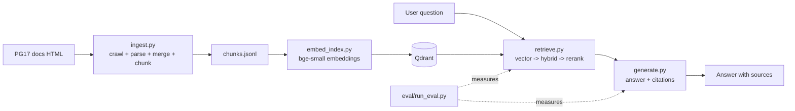

# AskPG

A production-style RAG (retrieval-augmented generation) system over the **PostgreSQL 17 documentation**, built with plain Python (no LangChain / LlamaIndex) and designed to be **measured**, not just demoed.

> **Status: work in progress.** Ingestion, chunking, embedding and vector search work. The evaluation set, hybrid retrieval, reranking, generation with citations, observability and CI gating are planned and not built yet. See [Status](#status).

## Goals

1. **Production RAG**: hybrid retrieval (BM25 + vector), cross-encoder reranking, citation enforcement, and a CI-gated evaluation pipeline.
2. **Observability**: tracing, per-stage latency (p50/p95), cost per request, quality metrics, and regression gating in CI.
3. **Evidence over vibes**: every change is evaluated on a fixed question set and logged in [`experiments.md`](experiments.md) with numbers, including a **closed-book baseline** (same questions, no retrieval) to show that retrieval adds real value.

## Architecture



Everything up to the vector store exists today. `retrieve.py` (beyond plain vector search), `generate.py` and `eval/` are planned.

## Design decisions

| Decision | Choice | Why |
|---|---|---|
| Framework | Plain Python scripts | Every step is visible and explainable. |
| Embedding model | `BAAI/bge-small-en-v1.5` (local, fp32) | Small and fast; runs on a 6 GB GPU or CPU. Query-side instruction prefix only, as the model recommends. |
| Vector DB | Qdrant (Docker) | A separate stateful service, as in production, so latency numbers include a real network hop. |
| Chunk sizing | Counted with the **embedder's own tokenizer** (BERT wordpiece), budget 400, overlap 60 | A first attempt counted with tiktoken and silently truncated 1.4% of chunks at the model's 512-token limit. |
| Small sections | **Merged into a neighbour**, not dropped | An audit showed dropping them removed real content (see [Findings](#findings)). |
| Cross-reference sections | "See Also" and "Author" sections skipped on purpose, and logged | They hold only cross-references and credits. Skipping is deliberate and visible in `skipped.jsonl`. |
| Chunk provenance | Each chunk carries `covers`: every original section merged into it | Lets the eval map a gold section to the chunk that now contains it. |
| Chunk context | Breadcrumb (`page > section`) prepended before embedding | Headings carry much of the meaning, especially on short reference-page chunks. |
| Point IDs | Deterministic UUIDv5 from `chunk_id` | Re-indexing overwrites instead of duplicating. |
| Eval gold labels | **URL + section anchor**, matched against `covers`; never `chunk_id` | Chunk IDs change whenever chunking changes. |
| Score thresholds | Not hard-coded | bge-small scores sit in a narrow band (~0.63-0.84); abstention will be calibrated on the eval set. |

## Repo layout

```
data/raw/             downloaded HTML (cached, resumable)
data/chunks/          chunks.jsonl, dropped.jsonl, skipped.jsonl
src/ingest.py         crawl -> parse -> merge small sections -> chunk -> JSONL
src/embed_index.py    embed chunks, load into Qdrant, query CLI
src/audit_dropped.py  one-off audit script (written for the pre-merge dropped.jsonl format)
src/retrieve.py       (planned) vector -> hybrid -> rerank
src/generate.py       (planned) answer generation with citations
eval/dataset.jsonl    (planned) questions + gold source sections
eval/run_eval.py      (planned) metrics, latency percentiles, CI gate
experiments.md        every run, with numbers
```

## Quickstart (Windows, Command Prompt)

Tested on Windows with project path `E:\Projects\AskPG`. Commands use `cmd` syntax.

**1. Install dependencies**

```
pip install requests beautifulsoup4 transformers sentence-transformers qdrant-client numpy
```

Optional, for NVIDIA GPU indexing: on Windows, `pip install sentence-transformers` pulls a CPU-only PyTorch. The GPU setup used in this project was:

```
pip uninstall -y torch
pip install torch==2.10.0 --index-url https://download.pytorch.org/whl/cu128
```

Check it worked:

```
python -c "import torch; print(torch.__version__, torch.cuda.is_available())"
```

**2. Start Qdrant**

```
docker run -d --name qdrant -p 6333:6333 -v "%cd%/qdrant_storage:/qdrant/storage" qdrant/qdrant
curl http://localhost:6333/healthz
```

On Linux/macOS use `$(pwd)` instead of `%cd%`. The image tag is not pinned yet (see [Known limitations](#known-limitations)).

**3. Crawl, chunk, index**

```
python src/ingest.py download
python src/ingest.py chunk
python src/embed_index.py index --recreate
```

In the index output, check for `Chunks longer than the model's 512-token limit: 0` and `Collection holds N points (expected N)`.

**4. Query**

```
python src/embed_index.py query "what does work_mem control?" -k 5
```

To eyeball chunk quality: `python src/ingest.py sample -n 20`.

## Status

| Component | State |
|---|---|
| Crawler + HTML parser + chunker (`ingest.py`) | Done |
| Audit of dropped short chunks | Done; fix applied (v2) |
| Verification of v2 (read the 33 remaining drops, spot-check a merged chunk, targeted queries) | **Pending** |
| Embedding + Qdrant indexing + query CLI (`embed_index.py`) | Done, run on real Qdrant + GPU |
| Eval set + metrics (recall@k, MRR, faithfulness, correctness) | Not started (next) |
| Closed-book baseline | Not started |
| BM25 hybrid retrieval | Not started |
| Cross-encoder reranker (`bge-reranker-base`) | Not started |
| Generation with citation enforcement | Not started |
| Tracing, latency percentiles, cost per request | Not started |
| CI regression gate | Not started |
| Dockerized app + thin frontend | Not started |

## Findings

Real numbers from runs so far. Retrieval quality has **not** been measured yet; there is no eval set, so nothing below is a quality claim.

### Indexing runs

| Run | Change | Chunks | Dropped | Truncated at 512 tok | Device | Throughput | Index time |
|---|---|---|---|---|---|---|---|
| v0 | tiktoken budget 380 | 6008 | not recorded | 83 (1.4%) | CPU | ~7 chunks/s | 807 s |
| v1 | BERT-tokenizer budget 400 (bug fix) | 6499 | 1019 | **0** | GPU | 62-82 chunks/s | 104 s |
| v2 | merge small sections (correctness fix) | 6489 | **33** | **0** | GPU | 66-79 chunks/s | 90 s |

v1 and v2 are bug fixes, not experiments: they define the baseline that later experiments are measured against.

- **Truncation bug (v0 to v1).** v0 counted tokens with a different tokenizer than the embedder, so 83 chunks exceeded the model's limit and their tails were silently never embedded. v1 counts with the embedder's tokenizer.
- **GPU vs CPU.** The default `pip install` gave a CPU-only PyTorch. A CUDA build cut indexing from 807 s to 104 s.
- **Silent data loss (v1 to v2).** v1 dropped 1019 chunks under 25 tokens, about 14% of candidate chunks (but only a small share of total text, since dropped chunks are tiny; that estimate is unmeasured). Logging and auditing them showed:
  - 994 of the 1019 were **entire sections missing from the index**; only 25 were leftovers of sections that were otherwise kept.
  - About 92% came from reference pages (`sql`, `spi`, `app`, `ecpg`, `contrib`), which are built from many tiny sections such as Synopsis, Compatibility and Parameters.
  - In a random sample of 25: 7 were pure cross-references or credits, 10 were substantive content (syntax, parameters, return values, compatibility statements), and 8 were one-line purpose statements. That is 18 of 25 with content; with a sample this small, the true rate is uncertain by tens of points.
  - Effect: whether a command's syntax was searchable depended on how long the syntax happened to be. That would have made retrieval look worse than it is in any eval.
  - Fix (v2): merge small sections into the next section (or the previous one at the end of a page); skip "See Also"/"Author" sections on purpose and log them. Result: dropped 1019 to 33, 762 sections merged, 243 skipped, chunks 6499 to 6489, truncation still 0.
- **Chunk sizes (v2).** Tokens per chunk: min 25, median 276, max 472. The max exceeds the 400 budget because carried-over overlap and held-back lead-in lines are added on top of a full chunk, and the embedder text also includes the breadcrumb. Re-check the truncation line whenever the budget or breadcrumb changes.
- **Not yet verified for v2:** the 33 remaining drops, that skipped sections are only "See Also"/"Author", and that a merged chunk (for example `sql-rollback`) really contains the folded-in synopsis.

### Smoke-test observations (3 queries, not a quality measure)

Run on the v0 index; a rerun on v2 is pending.

- `work_mem`: correct chunk at rank 1.
- MVCC / read locks: plausible rank 1, but ranks 2-5 drift onto locking topics.
- `ALTER TABLE ... SET LOGGED`: correct chunk at rank 1, but all top-5 hits came from the same page (`sql-altertable`). Short sibling chunks crowd the top-k. This motivates a reranker, per-page diversity, or merging small sections that are already kept, each to be tested through the eval.

### Planned results table

Filled in as each change is evaluated. Empty cells are unmeasured, not zero.

| Configuration | Recall@5 | MRR | Faithfulness | Answer correctness | p50 latency | p95 latency |
|---|---|---|---|---|---|---|
| Closed-book (no retrieval) | | | | | | |
| Vector only (v2 baseline) | | | | | | |
| + BM25 hybrid | | | | | | |
| + Reranker | | | | | | |
| + Citation enforcement | | | | | | |
| + Merge already-kept small sections | | | | | | |

## Evaluation plan

- 50-100 questions with gold source sections, including multi-hop, unanswerable and ambiguous questions.
- Gold labels reference **URL + section anchor** (or page + heading), never `chunk_id`. A retrieved chunk counts as a hit if the gold section appears in its `covers` field.
- A **coverage check** verifies every gold section exists in `chunks.jsonl` (in a chunk's `covers`), so missing sections cannot silently hide inside the metrics.
- One change at a time; re-run the eval after each; log the run in `experiments.md`.
- Latency percentiles come from many queries in a single process, with embed and search timed separately. Single-shot CLI timings include connection setup and are not quoted.
- Latency reported on both GPU and CPU, since a deployed version will likely run on CPU.

## Environment

- OS: Windows, Command Prompt
- RAM: 16 GB
- GPU: NVIDIA GTX 1660 Ti (6 GB), driver 610.74; torch 2.10.0+cu128
- Qdrant: Docker, localhost:6333, image tag not yet pinned
- Corpus: PostgreSQL 17 docs, 1127 pages crawled

## Known limitations

- Some chunks start mid-flow, because splitting is by token budget within a section.
- Many short chunks on SQL command reference pages can crowd search results.
- A merged chunk's URL points at the section it was merged into, not the small section folded in; use `covers` for provenance.
- Table cells are flattened to plain text.
- 33 chunks are still dropped after merging (under review).
- The Qdrant image tag is not pinned, so runs are not yet fully reproducible.
- Single node, no replication; not a high-availability setup.
- No LLM has been chosen for generation yet.

## Data and licensing

Documentation content is from the PostgreSQL project. The crawler is polite (identifies itself, rate-limited, caches pages) and intended for educational use. Check the PostgreSQL documentation license before redistributing any crawled content.